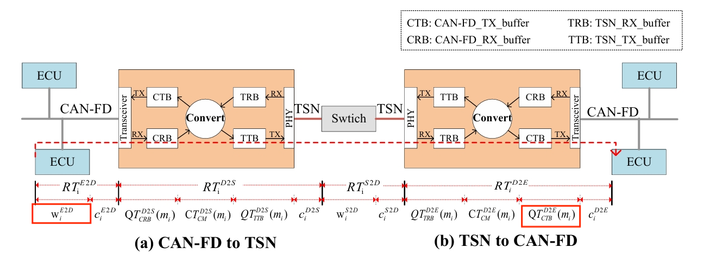

- [x] 分布式架构、域集中式架构、中央式架构
- [x] can-fd和can
- [ ] 汽车软件
- [ ] ECU\DCU

### abstract:

在域集中式架构下，跨域的端到端响应时间评估（跨TSN和CAN-FD）。针对CAN-FD到TSN的不同转换（一对一或多对一），消息在DCU(域控制单元)的不同等待时间,评估不同的响应时间

### introduction:

1.汽车分布式到集中式架构转变
2.CAN到CAN-FD的转变
3.两个工作:分析跨域的端到端通信响应时间,不同转换策略下DCU中混合关键信息的等待时间

### architecture and models

1.解释域集中式架构CAN-FD和TSN的互相转换架构图

2.消息模型mi={tyi,srci,desi,pi,si,di}

- tyi:消息类型1表示关键消息,否则为非关键消息
- srci和desi:源ECU和目的ECU
- pi:周期
- si:大小
- di:截止时间

### RTA OF CROSS-DOMAIN END-TO-END COMMUNICATION

​	1.响应时间分析(RTA): 排队和传输时间
​	2.计算ECU到DCU的RTA

​	

