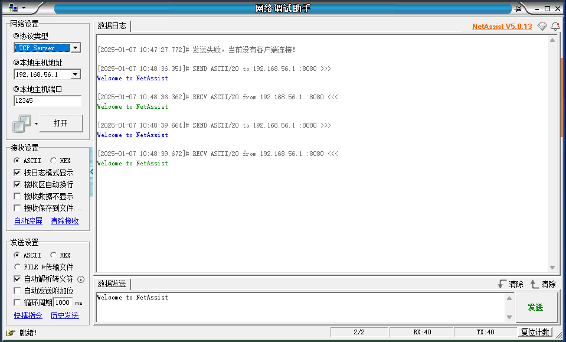
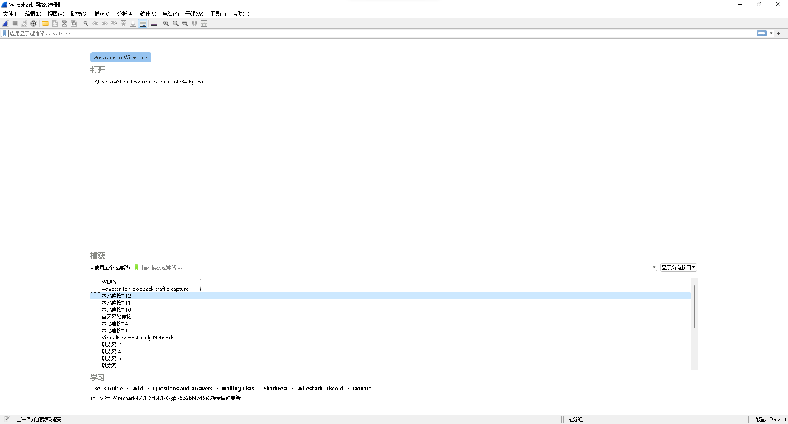
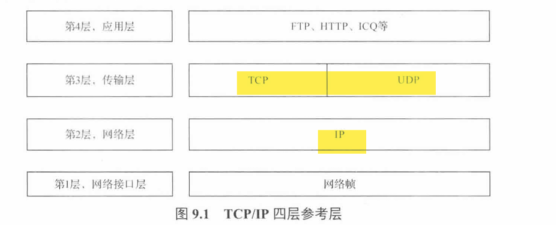
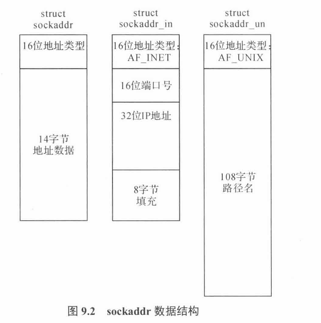
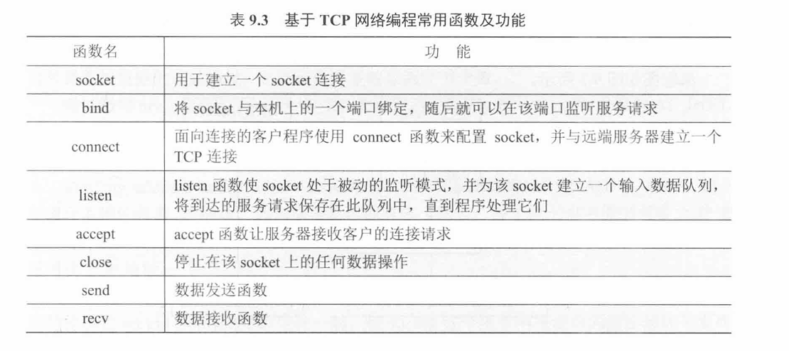
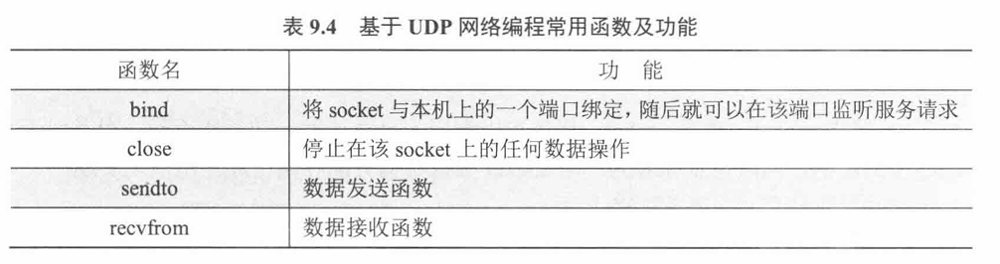
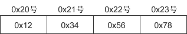
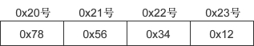

# 工具

## 网络调试助手NetAssist



## 抓包工具Wireshark



# 基础知识

带宽

```
概念：数据带宽是正在使用的数据传输速率的同义词，定义了一个数据链路的最大容量
例如
    一个10Mbps的铜线局域网不能承受速率高于10Mbps的流量
    一个使用600MBps调制解调器的卫星链路不能传输任何高于600Mbps的流量
```

吞吐量

```
概念：吞吐量是通过网络传输的真实数据量，也可以认为是在单位时间内通过网络从你的计算机到WEB服务器来回传输的真实数据量
```

信道利用率

```
信道利用率=吞吐量/带宽*100%
```


# 网络编程

## 网络四层



## socket 套接口数据结构

```
sockaddr、sockaddr_in、sockaddr_un、sockaddr_ll的区别以及使用场景
sockaddr*数据结构
	1)sockaddr：
        struct sockaddr
          { 
            sa_family_t sa_family; // 2字节
            char sa_data[14] //14字节
          };
    2)sockaddr_in
        struct sockaddr_in
          {
            sa_family_t sin_family;//协议族 2字节
            in_port_t sin_port;//端口号 2字节
            struct in_addr sin_addr;//ip地址 4字节
            char sin_zero[8]//填充，不起什么作用 8字节
          };
      3)sockaddr_un
      	sockaddr_un 主要用于 UNIX 域套接字（Unix Domain Sockets），通常与 AF_UNIX 地址族一起使用
      4)sockaddr_ll
      	sockaddr_ll 主要用于链路层（Link Layer）通信，通常与 AF_PACKET 地址族一起使用
```



## 基于TCP的常用收发函数



## 基于UDP的常用收发函数



---

```
sendto函数
bind函数
	作用，定义
	atoi函数:将字符串转换为整数
		int atoi(const char *str);
			1)会忽视开头的空格或制表符
			2)遇到非数字停止转换并返回
			3)若str中无数字或为空,返回0
recvfrom函数
```

### sendto

```
#include <sys/types.h>
#include <sys/socket.h>
ssize_t sendto(int sockfd, const void *buf, size_t len, int flags,
               const struct sockaddr *dest_addr, socklen_t addrlen);
               
1)功能： sendto函数用于通过套接字发送数据。
2)参数：
    sockfd：文件描述符，由socket函数返回。
    buf：指向要发送数据的缓冲区的指针。
    len：要发送的数据的长度。
    flags：标志位，用于指定发送操作的行为。常见的标志位有：
    0：阻塞模式，函数会一直等待直到数据发送完成。
    MSG_DONTWAIT：非阻塞模式，如果数据不能立即发送，函数会立即返回错误。
    dest_addr：指向目的网络信息结构体的指针，用于指定数据发送的目标地址。
    addrlen：目的网络信息结构体的长度。
3)返回值：
    成功：返回发送的字节数。
    失败：返回-1，并设置errno以指示错误原因。
sendto函数是网络编程中常用的函数之一，它允许我们向指定的目标地址发送数据。在使用该函数时，我们需要正确地指定目的地址和地址长度，以确保数据能够准确地发送到目标。同时，我们也需要注意选择合适的标志位，以满足不同的发送需求。
```

### bind

***由于服务器是被动的，客户端是主动的，所以一般先运行服务器，后运行客户端，所以服务器需要固定自己的信息（ip地址和端口号），这样客户端才可以找到服务器并与之通信，但是客户端一般不需要bind绑定，因为系统会自动给客户端分配ip地址和端口号,端口号可能会动态变化***

```
#include <sys/types.h>
#include <sys/socket.h>
int bind(int sockfd, const struct sockaddr *addr, socklen_t addrlen);

功能：
    将套接字与网络信息结构体绑定
参数：
    sockfd：文件描述符，socket的返回值
    addr：网络信息结构体
        通用结构体（一般不用）
            struct sockaddr
        网络信息结构体 
            sockaddr_in:#include <netinet/in.h>
            sockaddr_ll:#include <linux/if_packet.h>
    addrlen：addr的长度
返回值：
    成功：0
    失败：-1
```

### recvfrom

```
#include <sys/types.h>
#include <sys/socket.h>
 
ssize_t recvfrom(int sockfd, void *buf, size_t len, int flags,
                 struct sockaddr *src_addr, socklen_t *addrlen);
                 
功能：
    接收数据
参数：
    sockfd：文件描述符，socket的返回值
    buf：保存接收的数据
    len：buf的长度
    flags：标志位
        0 阻塞
        MSG_DONTWAIT 非阻塞
    src_addr：源的网络信息结构体（自动填充，定义变量传参即可）
    addrlen：src_addr的长度
返回值：
    成功：接收的字节数
    失败：-1
```

---


-----

```
socket()函数解析
   AF与PF的定义
   AF_INET和AF_PACKET的作用
   SOCK_STREAM、SOCK_RAW和SOCK_DGRAM三者有什么区别、三者的数据包处理是怎样的
   htons函数（网络字节序与主机字节序的转换）
   		大端序和小端序
   		网络字节序和主机字节序
```

# socket函数

```
int socket(int domain,int type,int protocol)；
	1）domain：指定协议族，它决定了套接字的地址类型。常见的协议族有：
        AF_INET：这是最常用的协议族，用于IPv4网络协议。它使用32位的地址，通常以点分十进制的形式表示，例如 192.168.1.1。
        AF_INET6：用于IPv6网络协议。它使用128位的地址，通常以冒号分隔的十六进制形式表示，例如 2001:0db8:85a3:0000:0000:8a2e:0370:7334。
        AF_UNIX：用于Unix域协议，它允许在同一台机器上的进程之间进行通信。Unix域套接字使用文件系统路径名作为地址。
        AF_UNSPEC：不指定协议族，通常用于地址信息的初始化，允许套接字与任何协议族兼容。
        AF_NETLINK：用于用户空间和内核空间之间的通信。
        AF_PACKET：用于直接访问网络层，通常用于创建原始套接字以接收或发送链路层帧。
-------------------------------------------------------------------------------------------------------------
这些协议族定义了套接字可以使用的地址格式和通信范围。根据你的应用程序需要连接的网络类型，你会选择合适的协议族。例如，如果你正在编写一个需要与互联网上的其他主机通信的应用程序，你会使用 AF_INET 或 AF_INET6。如果你正在编写一个在同一台机器上的进程间进行通信的应用程序，你可能会使用 AF_UNIX。
-------------------------------------------------------------------------------------------------------------
    2）type：指定套接字的类型，决定了数据传输的格式和方式。常见的套接字类型有：
        SOCK_STREAM：提供一个有序、可靠、双向字节流，通常使用TCP协议。
        	需要配合connect()函数使用
        SOCK_DGRAM：提供数据报文服务，是无连接的，不可靠的，通常使用UDP协议。
        	UDP无连接的服务,已经构造好部分的数据包
        SOCK_RAW：提供原始网络协议访问。
        	自行构造数据包
    3）protocol：指定具体的协议类型。通常这个参数设置为0，表示默认协议，会根据domain和type选择合适的协议。
    	如果domain为AF_PACKET，type为SOCK_RAW，该值应为自定义的协议
    4）函数返回值：
        成功时，返回一个非负整数，称为套接字描述符（socket descriptor），它是后续所有套接字操作的标识。
        失败时，返回-1，并设置errno来指示错误。
```


# 大小端/网络主机 字节序

不同CPU中，4字节整数1在内存空间的存储方式是不同的。4字节整数1可用2进制表示如下：

00000000 00000000 00000000 00000001

有些CPU以上面的顺序存储到内存，另外一些CPU则以倒序存储，如下所示：

00000001 00000000 00000000 00000000

若不考虑这些就收发数据会发生问题，因为保存顺序的不同意味着对接收数据的解析顺序也不同。

### 大端序和小端序

CPU向内存保存数据的方式有两种：

- 大端序（Big Endian）：高位字节存放到低位地址（高位字节在前）。
- 小端序（Little Endian）：高位字节存放到高位地址（低位字节在前）。

仅凭描述很难解释清楚，不妨来看一个实例。假设在 0x20 号开始的地址中保存4字节 int 型数据 0x12345678，对于大端序，最高位字节 0x12 存放到低位地址，最低位字节 0x78 存放到高位地址。

大端序CPU保存方式如下图所示：



 图1：整数 0x12345678 的大端序字节表示

小端序的保存方式如下图所示：



 图2：整数 0x12345678 的小端序字节表示

### 网络字节序和主机字节序

网络字节序是确定的，而主机字节序是多样的。

网络字节序统一为大端序。

主机字节序既可以是大端的，也可以是小端的，现代计算机大多采用小端字节序。

不同CPU保存和解析数据的方式不同（主流的Intel系列CPU为小端序），小端序系统和大端序系统通信时会发生数据解析错误。

为了避免这个问题，约定数据在不同计算机之间传递时都采用大端字节序，也叫作网络字节序。通信时，发送方需要把数据转换成网络字节序（大端字节序）之后再发送，接收方再把网络字节序转成自己的字节序。主机A先把数据转换成大端序再进行网络传输，主机B收到数据后先转换为自己的格式再解析。

### 网络字节序转换函数(htons)

htons() 用来将当前主机字节序转换为网络字节序，其中`h`代表主机（host）字节序，`n`代表网络（network）字节序，`s`代表short，htons 是 h、to、n、s 的组合，可以理解为”将short型数据从当前主机字节序转换为网络字节序“。

常见的网络字节转换函数有：

- htons()：host to network short，将short类型数据从主机字节序转换为网络字节序。
- ntohs()：network to host short，将short类型数据从网络字节序转换为主机字节序。
- htonl()：host to network long，将long类型数据从主机字节序转换为网络字节序。
- ntohl()：network to host long，将long类型数据从网络字节序转换为主机字节序。

通常，以`s`为后缀的函数中，`s`代表2个字节short，因此用于端口号转换；以`l`为后缀的函数中，`l`代表4个字节的long，因此用于IP地址转换。

例（在这个例子中使用了htons函数）：

```
//创建sockaddr_in结构体变量
struct sockaddr_in serv_addr;
memset(&serv_addr, 0, sizeof(serv_addr));  //每个字节都用0填充
serv_addr.sin_family = AF_INET;  //使用IPv4地址
serv_addr.sin_addr.s_addr = inet_addr("127.0.0.1");  //具体的IP地址
serv_addr.sin_port = htons(1234);  //端口号
```

---